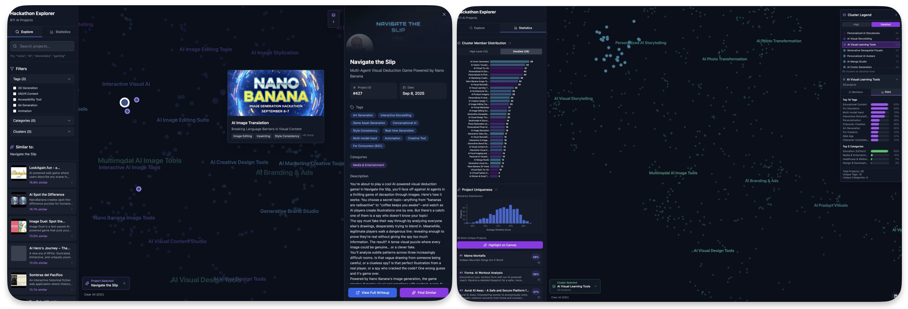
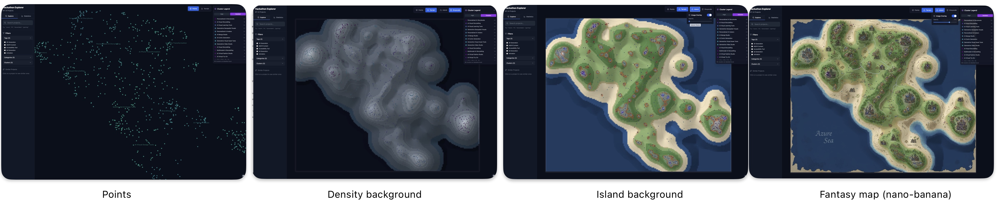

## Governance Data Mining Explorer (SN2)

A GenAI-powered governance intelligence system that transforms citizen grievance data into actionable insights for officers and policymakers. The system visualizes 500+ grievances across Telugu districts, clustered by category and severity, enabling pattern detection, hotspot identification, and early warning for emerging governance issues.

**Use Case:** SN2 — Governance Data Mining for Citizen Grievance Analysis

This explorer helps government officers:
- Identify recurring grievance patterns by geography and time
- Detect hotspots requiring immediate attention
- Query historical cases using natural language
- Track SLA compliance and resolution trends
- Generate policy recommendations based on data patterns


### Insights at a Glance (from 500 grievances)

- **Sanitation & Infrastructure dominate**: The majority of citizen complaints relate to waste management, water supply, and road conditions
- **Geographic patterns emerge**: Certain districts show recurring issues, enabling targeted interventions
- **Severity clustering**: Critical issues are automatically flagged for priority response
- **Temporal trends**: Pattern detection reveals seasonal spikes and emerging hotspots
- **Multi-level clustering**: High-level (10 categories) and Detailed (~27 sub-categories) enable both strategic and tactical insights


### Why this exists

Officers and policymakers need to quickly understand grievance landscapes across districts. This explorer reveals where issues concentrate, which departments need support, and where preventive interventions can stop small problems from becoming crises. The system bridges raw grievance data to actionable governance intelligence.

### UI at a glance

Two main modes — Explore and Statistics — with panels for filtering grievances by district, department, severity, and status. View temporal trends and geographic hotspot mapping.



### Data processing pipeline (pre‑processing)

Short version of the workflow that prepared this dataset:

1. Collect citizen grievances (text/audio/images) from multiple channels
2. Normalize and anonymize grievance data (Telugu + English)
3. Process each grievance with GenAI to:
   - Extract key issues and categorize by department
   - Generate standardized descriptions
   - Assign severity and SLA tracking
4. Create embeddings from standardized descriptions
5. Dimensionality reduction: PCA → UMAP for visualization
6. Hierarchical clustering on UMAP space (governance categories)
7. Summarize and label clusters (department-specific patterns)
8. Calculate similarity matrix for identifying related grievances


### What you can do

- **Explore Grievances**: Zoomable D3 scatter plot with cluster coloring, hover/click to view grievance details and similar cases
- **Geographic Hotspots**: Visualize as terrain map where grievance density creates elevation — identify problem areas at a glance
- **Temporal Analysis**: Track grievance trends over time, detect seasonal patterns and emerging issues
- **Department Analytics**: Statistics dashboard showing category breakdown, district distribution, severity analysis, and SLA compliance
- **Query System**: Natural language interface for officers to search historical cases and get resolution recommendations
- **Early Warning**: Predictive indicators for hotspot detection and pattern-based alerts

### Visual styles for navigation

Multiple background styles make the "project landscape" easier to read depending on task:

- Points (default) — pure scatter for maximum clarity
- Density background — soft contours reveal hotspots
- Island background — geographic metaphor over density
- Fantasy map (nano‑banana) — playful, readable world map skin for presentations



## Governance Categories

<p>This section provides an overview of major grievance categories observed across districts.</p>

<h3>Public Health & Infrastructure</h3>

<table>
  <tr>
    <td width="60%" valign="top">
      <h4>Sanitation & Waste Management</h4>
      <p><strong>Overview:</strong> Garbage collection delays, sewage overflow, public toilet maintenance issues</p>
      <p><strong>Key Patterns:</strong></p>
      <ul>
        <li><strong>Garbage Collection Delays:</strong> Regular pickup services not functioning, accumulation in residential areas</li>
        <li><strong>Sewage Overflow:</strong> Drainage systems blocked or overflowing, especially during monsoon</li>
        <li><strong>Public Toilet Issues:</strong> Maintenance and cleanliness concerns at community facilities</li>
      </ul>
    </td>
    <td width="40%" valign="top">
      <p><em>Highest volume category with recurring patterns in urban areas</em></p>
    </td>
  </tr>
</table>

<table>
  <tr>
    <td width="60%" valign="top">
      <h4>Water Supply & Quality</h4>
      <p><strong>Overview:</strong> Irregular supply, contamination, infrastructure damage</p>
      <p><strong>Key Patterns:</strong></p>
      <ul>
        <li><strong>Supply Interruption:</strong> Irregular or complete absence of water supply</li>
        <li><strong>Quality Issues:</strong> Contaminated or unsafe drinking water reported</li>
        <li><strong>Pipeline Problems:</strong> Leaks, bursts, and infrastructure requiring repair</li>
      </ul>
    </td>
    <td width="40%" valign="top">
      <p><em>Critical issue with high severity classifications</em></p>
    </td>
  </tr>
</table>

<h3>Infrastructure & Utilities</h3>

<table>
  <tr>
    <td width="60%" valign="top">
      <h4>Roads & Street Infrastructure</h4>
      <p><strong>Overview:</strong> Road damage, lighting issues, pedestrian safety</p>
      <p><strong>Key Patterns:</strong></p>
      <ul>
        <li><strong>Road Potholes:</strong> Damaged roads causing accidents and vehicle damage</li>
        <li><strong>Street Lighting:</strong> Non-functional lights creating safety concerns</li>
        <li><strong>Footpath Damage:</strong> Broken pedestrian paths and accessibility issues</li>
      </ul>
    </td>
    <td width="40%" valign="top">
      <p><em>Consistent complaints across all districts</em></p>
    </td>
  </tr>
</table>

<table>
  <tr>
    <td width="60%" valign="top">
      <h4>Electricity & Power</h4>
      <p><strong>Overview:</strong> Power cuts, equipment failure, billing disputes</p>
      <p><strong>Key Patterns:</strong></p>
      <ul>
        <li><strong>Frequent Power Cuts:</strong> Unscheduled outages affecting daily life</li>
        <li><strong>Transformer Issues:</strong> Equipment breakdown affecting large populations</li>
        <li><strong>Billing Problems:</strong> Incorrect meter readings and payment disputes</li>
      </ul>
    </td>
    <td width="40%" valign="top">
      <p><em>Seasonal spikes during summer months</em></p>
    </td>
  </tr>
</table>

<h3>Essential Services</h3>

<table>
  <tr>
    <td width="60%" valign="top">
      <h4>Healthcare Services</h4>
      <p><strong>Overview:</strong> Staff shortages, medicine availability, emergency response</p>
      <p><strong>Key Patterns:</strong></p>
      <ul>
        <li><strong>Staff Shortage:</strong> Insufficient medical personnel at health centers</li>
        <li><strong>Medicine Availability:</strong> Essential drugs out of stock</li>
        <li><strong>Emergency Services:</strong> Ambulance delays and response time issues</li>
      </ul>
    </td>
    <td width="40%" valign="top">
      <p><em>High severity requiring immediate attention</em></p>
    </td>
  </tr>
</table>

<table>
  <tr>
    <td width="60%" valign="top">
      <h4>Education & Schools</h4>
      <p><strong>Overview:</strong> Infrastructure needs, staff availability, student facilities</p>
      <p><strong>Key Patterns:</strong></p>
      <ul>
        <li><strong>School Infrastructure:</strong> Building repairs and maintenance needed</li>
        <li><strong>Teacher Availability:</strong> Staff shortages affecting education quality</li>
        <li><strong>Student Facilities:</strong> Basic amenities like toilets and drinking water</li>
      </ul>
    </td>
    <td width="40%" valign="top">
      <p><em>Long-term impact on community development</em></p>
    </td>
  </tr>
</table>

### Terrain visualization (optional)

Turn grievance density into a geographic metaphor to reveal hotspots and problem areas at a glance.

- Grievance density → elevation via KDE over UMAP coordinates
- Visual styles (Natural, Urban) highlighting concentration areas
- Export high-resolution hotspot maps for reporting and planning
- Settlement overlays indicate areas requiring immediate attention

### Severity Index (how it's computed)

- Definition: Calculated based on citizen impact, response time urgency, and historical resolution complexity
- Factors: Population affected, infrastructure criticality, health/safety risk, SLA breach likelihood
- Interpretation: Higher severity → requires immediate officer attention and escalation to supervisors
- Use: Automated priority queuing and resource allocation for field teams

### Live Demo

- Start here: [serjoschduering.github.io/kgl-submission-explorer](https://serjoschduering.github.io/kgl-submission-explorer/)

### Getting Started (local)

```bash
npm install
npm run dev
```

### Tech Stack

- **Frontend**: React 18 + TypeScript
- **Build**: Vite
- **Visualization**: D3 (SVG)
- **State**: Zustand
- **Styles**: Tailwind
- **Data**: Mock governance grievance data (500 entries) with district, department, severity classifications


### System Architecture (SN2)

This governance data mining system demonstrates:

1. **RAG-based Chatbot**: Officers query historical cases in natural language
2. **Hotspot Detection**: Geographic and temporal clustering for early warning
3. **Pattern Analytics**: Identify recurring issues before they escalate
4. **Dashboard Views**: Personalized officer workload and policy insights
5. **Feedback Loop**: Officer actions improve future predictions and recommendations

### Notes & disclaimer

- This is a demonstration system using mock grievance data for Telugu districts
- Production deployment would integrate with actual grievance management systems (e.g., CPGRAMS)
- The NL query chatbot interface and predictive analytics are conceptual mockups
- Real implementation would require proper data governance, privacy controls, and officer authentication
